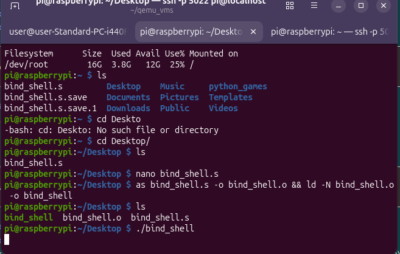
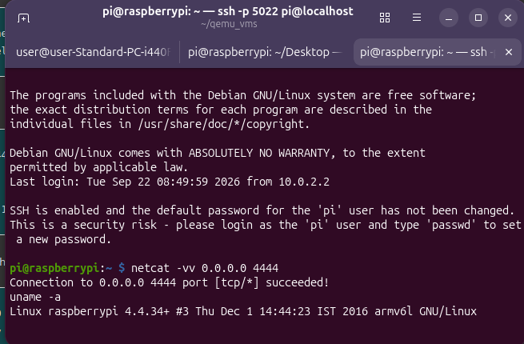

# Bind Shell — README

## Build Instructions

### Step 1: Start the bind shell

In one terminal:

```bash
pi@raspberrypi:~/bindshell $ as bind_shell.s -o bind_shell.o && ld -N bind_shell.o -o bind_shell
pi@raspberrypi:~/bindshell $ ./bind_shel
```


### Step 2: Connect from another terminal

In a second terminal:

```bash
pi@raspberrypi:~ $ netcat -vv 0.0.0.0 4444
```


### Step 3: Interact with the shell
Once connected, you should see a shell prompt ($). Try:

```bash
id
uname -a
ls
```