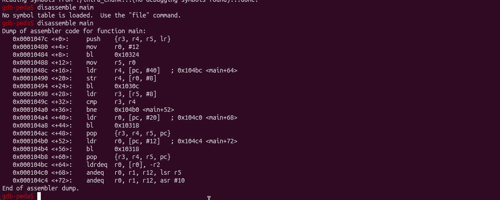
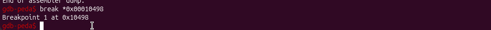
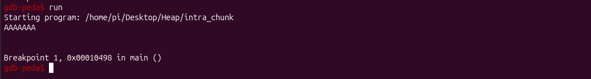
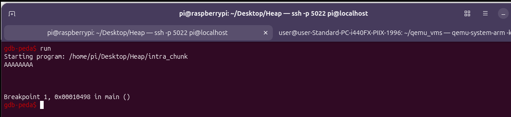
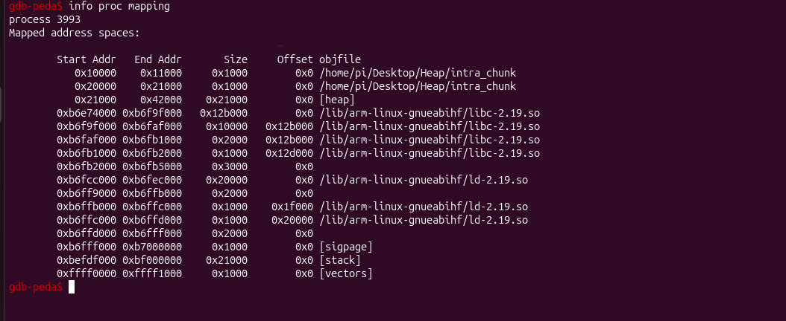
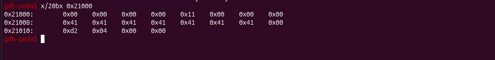
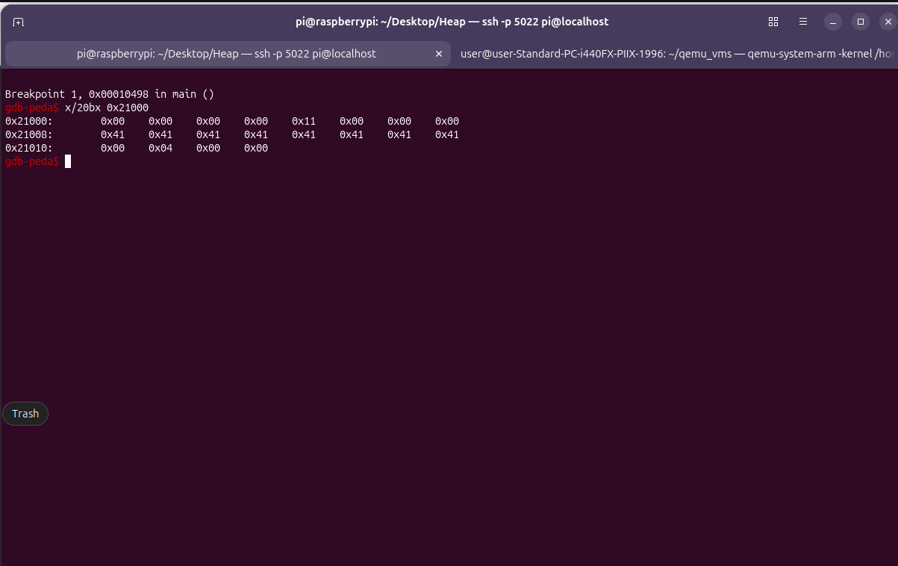
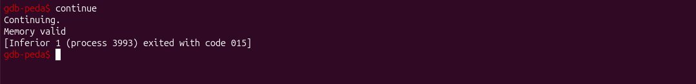
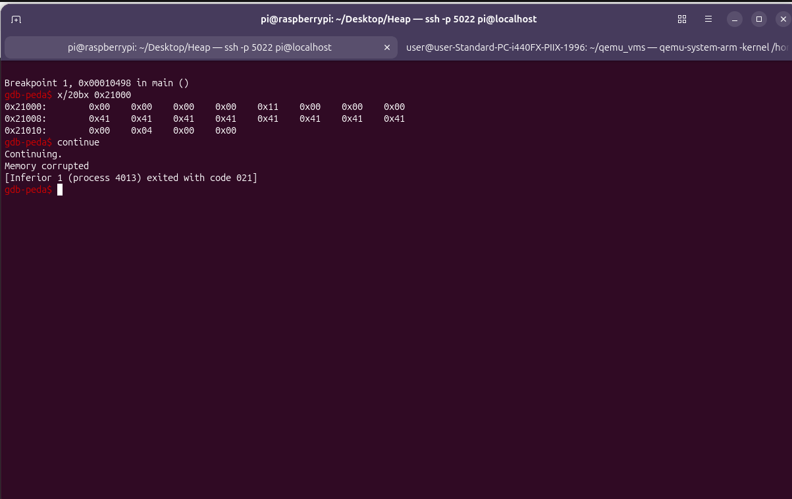

# Intra Chunk Heap Overflow Lab
A beginner-friendly guide to understanding, compiling, debugging, and exploiting the intra-chunk heap overflow vulnerability.

## Disclaimer
Do not use these techniques on systems you do not own or have explicit permission to test.

## Overview
This lab demonstrates an intra-chunk heap overflow — a memory corruption bug where user input spills from one field of a struct into the next field of the same heap chunk.

The program creates a heap object with two fields:

name[8] — an 8-byte character buffer

number — a 4-byte integer set to 1234

It then uses the unsafe gets() function to read user input into name. Because gets() doesn't check length, typing 8 or more characters causes the null terminator (or more) to overwrite the number field.

Goal: Corrupt number so the program prints "Memory corrupted" instead of "Memory valid" — reaching a code path the programmer thought was impossible.

## The Vulnerable Code
File: C/Heap_overflow/intra_chunk.c

## Memory Layout

### Struct Layout (12 bytes total)
```bash
Offset  0    1    2    3    4    5    6    7    8    9   10   11
      ┌────┬────┬────┬────┬────┬────┬────┬────┬────┬────┬────┬────┐
      │         name[8]                       │       number        │
      └────┴────┴────┴────┴────┴────┴────┴────┴────┴────┴────┴────┘
      ↑                                        ↑
   objA->name                              objA->number
```

### Heap Chunk Layout
```bash
┌──────────────────┬─────────────────────────────────┐
│  Chunk Header    │        User Data (12 bytes)     │
│  (8 bytes)       │  ┌──────────────┬────────────┐  │
│  size + flags    │  │  name[8]     │  number    │  │
└──────────────────┴──┴──────────────┴────────────┴──┘
```

## Compile
``` bash
gcc intra_chunk.c -o intra_chunk -O
```

## Debugging Walkthrough
### Step 1: Start GDB
``` bash
gdb intra_chunk
```

### Step 2: Disassemble main
``` bash
disassemble main
```



### Step 3: Set the Breakpoint
Break right after the bl gets instruction:
``` bash
break *0x00010498
``` 



#### Your address may differ! Always read your own disassembly. The rule is:
Find bl <gets@plt> → break at the very next instruction.

### Step 4: Run the Program
``` bash
run
``` 

### Step 5: Provide Input
Safe case — type 7 A's:
``` bash
AAAAAAA
```


Attack case — type 8 A's (or more):
```bash
AAAAAAAA
```


### Step 6: Find the Heap Address
```bash
vmmap
```

If vmmap doesn't work (common with PEDA or remote sessions), use:
```bash
info proc mappings
```

Look for the [heap] line:


### Step 7: Inspect the Heap
``` bash
x/20bx 0x21000
```
#### Safe case (7 A's):



```bash
0x21000:  0x00 0x00 0x00 0x00  0x11 0x00 0x00 0x00   ← chunk header
0x21008:  0x41 0x41 0x41 0x41  0x41 0x41 0x41 0x00   ← name = "AAAAAAA\0"
0x21010:  0xd2 0x04 0x00 0x00                        ← number = 1234
```

### Attack case (8 A's):



```bash
0x21000:  0x11 0x00 0x00 0x00  0x00 0x00 0x00 0x00   ← chunk header (unchanged)
0x21008:  0x41 0x41 0x41 0x41  0x41 0x41 0x41 0x41   ← name = "AAAAAAAA"
0x21010:  0x00 0x04 0x00 0x00                        ← number = 1024 
```

Notice: The 9th byte (null terminator from gets) overwrote the first byte of number, changing 0x000004d2 (1234) to 0x00000400 (1024).

### Step 8: Continue Execution
```bash
continue
```

#### Safe case output: Memory valid 



#### Attack case output: Memory corrupted


### References
Azeria Labs: Process Memory and Memory Corruption

Azeria Labs: ARM Assembly Basics

GEF (GDB Enhanced Features)

PEDA

pwndbg
