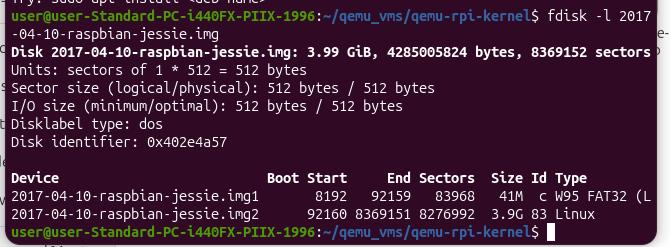
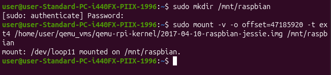
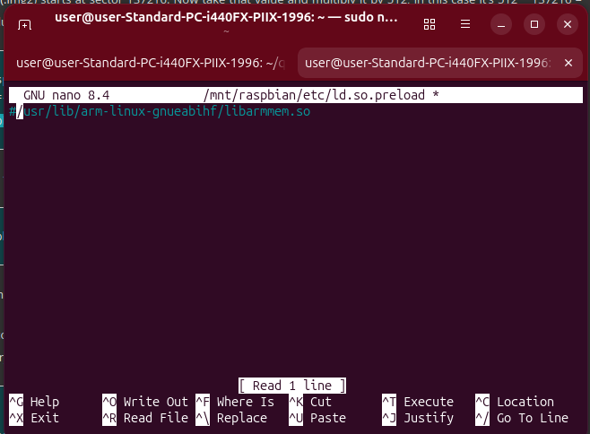
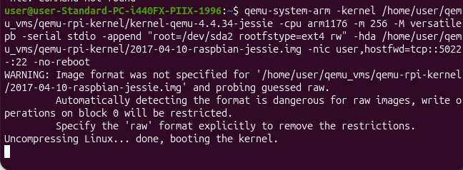
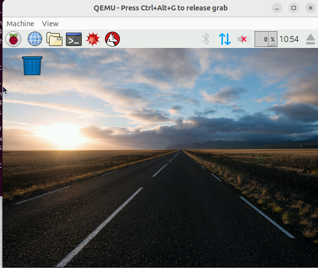

# RASPBERRY PI ON QEMU

1. Download raspbian jessie image : https://downloads.raspberrypi.org/raspbian/images/raspbian-2017-04-10/
2. Unzip .zip file to get raspbian image
3. ​ Download latest qemu kernel: https://github.com/dhruvvyas90/qemu-rpi-kernel
4. Create new folder : $ mkdir ~/qemu_vms/
5. ​ Move raspbian image and qemu kernel to ~/qemu_vms/
6. ​ $ sudo apt-get install qemu-system
7. ​ fdisk -l 2017-04-10-raspbian-jessie.img

8.​ Take the value of filesystem (.img2) 92160 and multiply by 512 = 47185920 bytes. I use
this value as an offset in following command

9. ​ sudo nano /mnt/raspbian/etc/ld.so.preload
Comment out every entry in that file with ‘#

10. $ cd ~
$ sudo umount /mnt/raspbian

11. ​Emulate it on Qemu by using the following commanded:

12. I get GUI of raspbian OS

